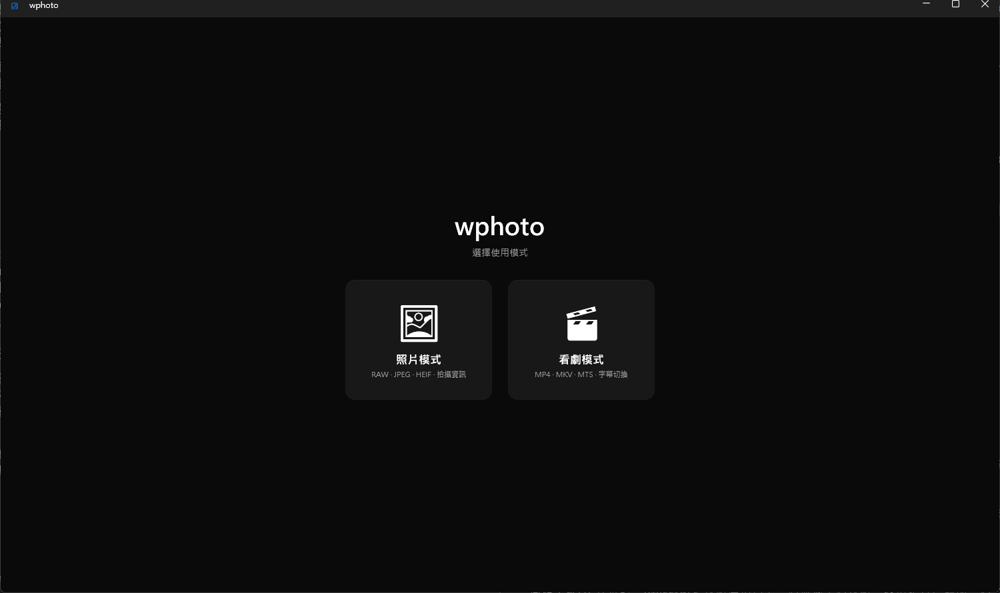

# wphoto

**Blazing-fast RAW photo viewer & culler for Fujifilm / Sony shooters — with a built-in theater mode for your video library.**
Opens an 80 MB RAF in a blink by reading the camera's embedded full-size preview, and plays 10-bit H.265 MKV without installing a single codec.

**專為 Fuji / Sony 使用者打造的極速 RAW 篩片工具，內建看劇模式**——RAW 秒開、4K HEVC 直接播。


Two modes at startup · 啟動時選擇模式：



## Photo mode · 照片模式

- **20+ RAW formats** — RAF, ARW, CR2/CR3, NEF, DNG, ORF, RW2 and more (via LibRaw). Embedded-preview fast path, full decode as fallback
- **JPEG / HEIF (.HIF)** — every Fuji / Sony still format, HEIF decoded without system extensions
- **Full shooting info panel** — camera, lens, ISO, shutter, aperture, focal length, exposure mode, GPS…
- **Zoom & pan** — mouse-wheel zoom up to 1000%, drag to pan, double-click to reset
- **Recursive folder scan** with file-type filter (only shows types that actually exist in the folder)

## Theater mode · 看劇模式

- **Episode picker with covers** — open a whole season folder and pick an episode from a thumbnail grid (Netflix-style)
- **Plays everything** — MP4 (XAVC S/HS), MOV, MKV, MTS/M2TS (AVCHD), AVI, MXF via bundled LibVLC; 10-bit H.265 / Dolby Vision files just work
- **Subtitles** — switch embedded subtitle tracks, auto-loads external .srt/.ass/.ssa/.sub/.vtt from the folder (incl. `Subs` subfolder)
- **Full playback controls** — seekable progress bar, playback speed 0.5x–2.0x, play/pause
- **YouTube-style fullscreen** — true edge-to-edge, controls auto-hide when idle and reappear on mouse move

<details>
<summary>中文功能說明</summary>

**照片模式**
- 20+ 種 RAW 格式（RAF、ARW、CR2/CR3、NEF、DNG…），優先讀內嵌預覽、秒開大檔
- JPEG / HEIF (.HIF) 全支援，HEIF 不需系統擴充
- 完整拍攝資訊面板：相機、鏡頭、ISO、快門、光圈、焦距、GPS…
- 滾輪縮放（最大 1000%）、拖曳平移、雙擊還原
- 遞迴掃描子資料夾、依類型篩選

**看劇模式**
- 封面選集畫面：選整季資料夾後用縮圖卡片挑集數
- 內建 LibVLC：MP4、MOV、MKV、MTS/M2TS、AVI、MXF 全都能播，10-bit H.265 免裝解碼器
- 字幕：內嵌字幕軌切換、自動載入同資料夾（含 Subs）的外掛字幕
- 進度條拖曳跳轉、0.5x–2.0x 倍速、播放/暫停
- YouTube 式全螢幕：完全滿版、控制列閒置自動隱藏

</details>

## Playback capabilities · 播放能力與限制

Everything mainstream opens and plays — the limits below are about *presentation quality*, inherited from the LibVLC 3 engine (same as VLC itself):

| Video | Status |
|---|---|
| H.265/HEVC 10-bit, 4K high-bitrate | ✅ Full support (hardware-accelerated + software decode) |
| HDR10 | ⚠️ Plays, tone-mapped to SDR for display |
| HDR10+ | ⚠️ Dynamic metadata ignored, treated as HDR10 |
| Dolby Vision (hybrid, with HDR10 base layer) | ✅ Plays via base layer |
| Dolby Vision Profile 5 (no base layer) | ⚠️ Known LibVLC 3 color-shift issue (purple/green tint) |

| Audio | Status |
|---|---|
| DD+ (E-AC-3), AC-3 | ✅ Full decode |
| TrueHD, DTS-HD MA | ✅ Decodes |
| Dolby Atmos | ⚠️ Core 5.1/7.1 only — the object/height layer is ignored; downmixed to your output device |

<details>
<summary>中文說明</summary>

主流最高規格的檔案**都播得開**，以下限制是「呈現品質」層面，繼承自 LibVLC 3 引擎（與 VLC 播放器相同）：

- **H.265 10-bit 4K 高碼率**：完全支援（硬體加速＋軟解）
- **HDR10 / HDR10+**：可播放，但會 tone-map 成 SDR 顯示；HDR10+ 動態 metadata 忽略
- **Dolby Vision**：Hybrid（帶 HDR10 底層）正常播；純 Profile 5 檔案有 LibVLC 3 已知的紫綠色偏問題
- **DD+ / AC-3 / TrueHD / DTS-HD MA**：正常解碼
- **Dolby Atmos**：只解核心 5.1/7.1 聲道，天空聲道物件層忽略，依輸出裝置下混

</details>

## Download · 下載

Grab the latest zip from [Releases](https://github.com/lintaixu/wphoto/releases), unzip, run `PhotoViewer.exe`. No installation, no .NET runtime, no codecs required.

從 [Releases](https://github.com/lintaixu/wphoto/releases) 下載 zip，解壓縮後直接執行 `PhotoViewer.exe`，免安裝、免 .NET、免解碼器。

## Keyboard & mouse · 操作

| Action | Input |
|---|---|
| Next / previous file | `↑` `↓` (photo mode also `←` `→`) |
| Zoom photo | Mouse wheel |
| Pan (when zoomed) | Left-drag |
| Reset zoom | Double-click |
| Play / pause video | `Space` |
| Seek −10s / +10s | `←` `→` |
| Fullscreen | `F11` (exit: `Esc`) |
| Episode picker | 「選集」 toolbar button |
| Open folder | Button, or drag & drop a folder onto the window |

## Build from source · 從原始碼建置

```
dotnet build PhotoViewer
```

Release build:

```
dotnet publish PhotoViewer -c Release -r win-x64 --self-contained -p:PublishSingleFile=true -p:IncludeNativeLibrariesForSelfExtract=true
```

Ship `PhotoViewer.exe` together with the `libvlc` folder.

## Tech stack · 技術

- .NET 9 / WPF + [WPF-UI](https://github.com/lepoco/wpfui) (Fluent)
- [Sdcb.LibRaw](https://github.com/sdcb/Sdcb.LibRaw) — RAW decoding (LibRaw)
- [MetadataExtractor](https://github.com/drewnoakes/metadata-extractor-dotnet) — EXIF
- [LibVLCSharp](https://github.com/videolan/libvlcsharp) — video playback (LibVLC, LGPL-2.1; shipped as separate DLLs)
- [Magick.NET](https://github.com/dlemstra/Magick.NET) — HEIF decoding

## License · 授權

[MIT](LICENSE). Video playback uses LibVLC under LGPL-2.1, distributed as separate dynamic libraries in the `libvlc` folder.

Sample images in the screenshot are CC0 from [raw.pixls.us](https://raw.pixls.us).
