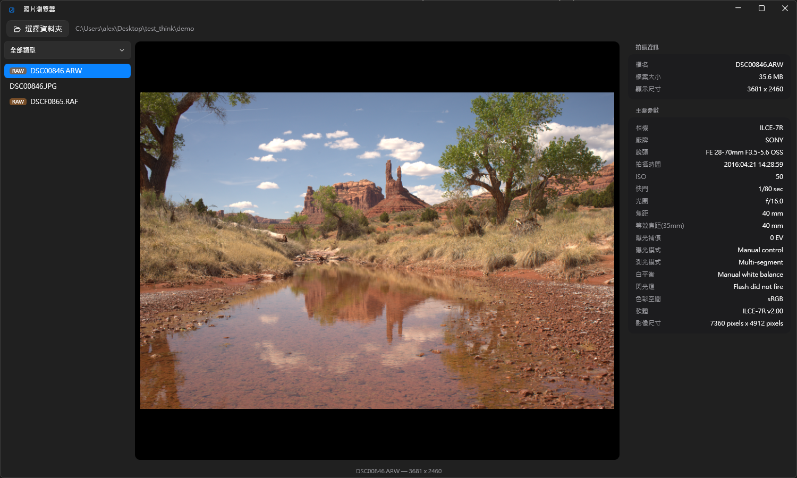

# wphoto

**Blazing-fast RAW photo viewer & culler for Fujifilm / Sony shooters.**
Opens an 80 MB RAF in a blink by reading the camera's embedded full-size preview — no waiting for a full RAW decode.

**專為 Fuji / Sony 使用者打造的極速 RAW 篩片工具**——直接讀取相機內嵌的全尺寸預覽，80 MB 的 RAF 也能秒開。



## Features · 功能

- **20+ RAW formats** — RAF, ARW, CR2/CR3, NEF, DNG, ORF, RW2 and more (via LibRaw). Embedded-preview fast path, full decode as fallback
- **Every Fuji / Sony capture format** — JPEG, HEIF (.HIF), MOV, MP4 (XAVC S/HS), MTS/M2TS (AVCHD)
- **Video playback built in** — bundled LibVLC plays 10-bit H.265 without installing any system codecs
- **Full shooting info panel** — camera, lens, ISO, shutter, aperture, focal length, exposure mode, GPS…
- **Zoom & pan** — mouse-wheel zoom up to 1000%, drag to pan, double-click to reset
- **Recursive folder scan** with file-type filter (only shows types that actually exist in the folder)
- **Dark, minimal UI** — pure black background that keeps your photos front and center

<details>
<summary>中文功能說明</summary>

- **20+ 種 RAW 格式**——RAF、ARW、CR2/CR3、NEF、DNG、ORF、RW2 等（LibRaw 解碼），優先讀內嵌預覽、秒開大檔
- **Fuji / Sony 全部拍攝格式**——JPEG、HEIF (.HIF)、MOV、MP4 (XAVC S/HS)、MTS/M2TS (AVCHD)
- **內建影片播放**——內附 LibVLC，10-bit H.265 直接播，不用裝任何系統解碼器
- **完整拍攝資訊面板**——相機、鏡頭、ISO、快門、光圈、焦距、曝光模式、GPS…
- **縮放與平移**——滾輪縮放最大 1000%、拖曳平移、雙擊還原
- **遞迴掃描子資料夾**，依檔案類型篩選（選單只列出資料夾中實際存在的類型）
- **深色極簡介面**——純黑背景，讓照片成為主角

</details>

## Download · 下載

Grab the latest zip from [Releases](https://github.com/lintaixu/wphoto/releases), unzip, run `PhotoViewer.exe`. No installation, no .NET runtime, no codecs required.

從 [Releases](https://github.com/lintaixu/wphoto/releases) 下載 zip，解壓縮後直接執行 `PhotoViewer.exe`，免安裝、免 .NET、免解碼器。

## Keyboard & mouse · 操作

| Action | Input |
|---|---|
| Next / previous file | `↑` `↓` `←` `→` |
| Zoom | Mouse wheel |
| Pan (when zoomed) | Left-drag |
| Reset zoom | Double-click |
| Play / pause video | `Space` |
| Open folder | Button, or drag & drop a folder onto the window |

## Build from source · 從原始碼建置

```
dotnet build PhotoViewer
```

Release build:

```
dotnet publish PhotoViewer -c Release -r win-x64 --self-contained -p:PublishSingleFile=true -p:IncludeNativeLibrariesForSelfExtract=true
```

Ship `PhotoViewer.exe` together with the `libvlc` folder.

## Tech stack · 技術

- .NET 9 / WPF + [WPF-UI](https://github.com/lepoco/wpfui) (Fluent)
- [Sdcb.LibRaw](https://github.com/sdcb/Sdcb.LibRaw) — RAW decoding (LibRaw)
- [MetadataExtractor](https://github.com/drewnoakes/metadata-extractor-dotnet) — EXIF
- [LibVLCSharp](https://github.com/videolan/libvlcsharp) — video playback (LibVLC, LGPL-2.1; shipped as separate DLLs)
- [Magick.NET](https://github.com/dlemstra/Magick.NET) — HEIF decoding

## License · 授權

[MIT](LICENSE). Video playback uses LibVLC under LGPL-2.1, distributed as separate dynamic libraries in the `libvlc` folder.

Sample images in the screenshot are CC0 from [raw.pixls.us](https://raw.pixls.us).
